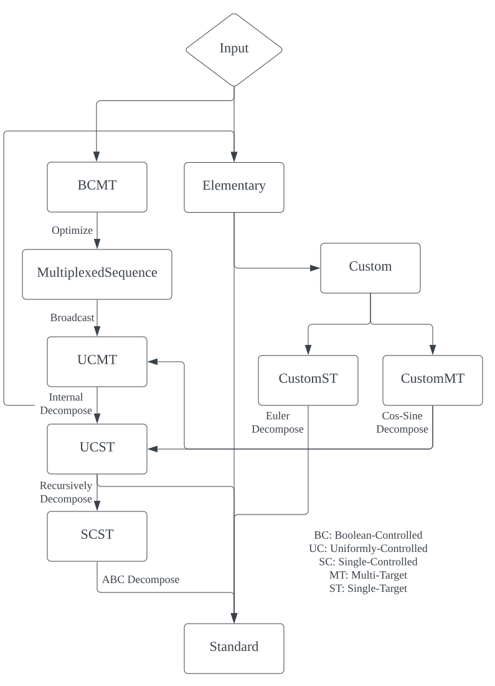

# Stateq: An experimental high-level functional quantum programming language 

Stateq is a high-level, concise, and mathematical syntax programming language for quantum computing, designed to provide a simple, efficient, and scalable solution for developing quantum algorithms and applications.

The following code is an example of Shor's algorithm in Stateq:

```rust
// 4n+2 qubits shor's algorithm

extern func modInv(a: Int, m: Int) => Int;

operation QFT($phi: ?n) {
    for i in [0 : n] {
        H $phi[n - 1 - i];
        for j in [i + 1 : n] {
            P[pi / 2**(j-i)] $phi[n - 1 - i] ctrl &phi[n - 1 - j];
        }
    }
    each i in [0 : n / 2] | SWP $phi[i, n - i - 1];
}

operation PhaseAdder[value: Int]($phi: ?n) {
    let p: Int = 2**n;
    for i in [0 : n] {
        if ((value % p + p) % p) & (1 << (n - 1 - i)) != 0 {
            each j in [0 .. i] | P[pi / (2**(i-j))] $phi[j];
        }
    }
}

operation Adder[value: Int]($phi: ?n) {
    with QFT $phi {
        PhaseAdder[value] $phi;
    }
}

operation ModAdder[value: Int, modValue: Int]($phi: ?n) {
    let addition = (value % modValue + modValue) % modValue;
    $phi.|0⟩ as $work;
    |0⟩ as $ancilla;
    Adder[-modValue] Adder[addition] $work;
    X $ancilla ctrl &work[n];
    Adder[modValue] $work ctrl &ancilla;
    with Adder[-addition] $work {
        with X $work[n] {
            X $ancilla ctrl &work[n];
        }
    }
}

operation ModAdderMult[value: Int, modValue: Int]($phi: ?m) {
    let mult: Int = (value % modValue + modValue) % modValue;
    let n: Int = m / 2;
    for i in [0 : n] {
        let a = (2**i % modValue) * mult % modValue;
        ModAdder[a, modValue] $phi[n : 2*n] ctrl &phi[i];
    }
}

operation ModMultiplier[value: Int, modValue: Int]($phi: ?n) {
    let mult: Int = (value % modValue + modValue) % modValue;
    let multInv: Int = modValue - modInv(mult, modValue);
    ModAdderMult[mult, modValue] $phi.|0'n⟩ as $work;
    each i in [0 : n] | SWP $work[i, n + i];
    ModAdderMult[multInv, modValue] $work;
}

program ShorPeriodFinder[a: Int, modValue: Int] shot(4096) {
    let n: Int = ceil(log2i(modValue));
    let m: Int = 2 * n;
    H@m |0'm⟩ as $psi;
    |0b1'n⟩ as $ancilla;
    for i in [: m] {
        ModMultiplier[a**(2**i), modValue] $ancilla ctrl &psi[i];
    }
    measure QFT! $psi;
}
```


## Why Stateq

Current quantum programming languages (like Q#, Quil, Cirq, Quingo, etc.) and quantum programming frameworks (like Qiskit, Pennylane, etc.) suffer from the following problems:

1. Strong platform dependency and hardware-software coupling. for example, Qiskit can only run on IBM quantum devices and simulators, and the underlying implementation of the framework is closely related to the corresponding quantum hardware.
2. Not flexible enough, relatively poor scalability and portability. 
3. Redundant syntax, lack of clear mathematical representation.
4. Difficult to identify and locate potential bugs at compile time (for compiled ones) or even at runtime.
5. Quantum computing resources (e.g. qubits) often need to be allocated and recycled manually.
6. Most of the compiled languages are unable to handle complex classical computations (e.g., dynamically generating a unitary matrix as an operator based on the users' input), and cannot be called efficiently with classical interfaces as well. 
7. Most of them depend on a large runtime, e.g. Q# depends on .NET, Qiskit depends on Python. It is not friendly for some special devices (e.g. embedded devices, FPGAs, etc.).


## Design principles

### Concise and Mathematical Syntax

Stateq's concise and mathematical syntax allows for a more streamlined approach to quantum programming, reducing the amount of code required by 50% compared to mainstream quantum programming languages and allowing for more intuitive representations of quantum circuits. 

### Write Once Run Anywhere

Stateq's Quantum Intermediate Virtual Machine (QIVM) allows for complete decoupling from the underlying quantum hardware platform. By dynamically compiling complex quantum circuits into platform-specific optimized quantum circuits, containing only the quantum gates supported by the target platform, Stateq ensures seamless compatibility with a variety of quantum hardware platforms. 

Due to its decoupling from the underlying quantum hardware platform, Stateq provides a significant advantage in terms of migration costs to new platforms, making it much lower than other quantum programming languages. 

### Quantum Program Only Do Quantum Things

Stateq adheres to the principle of "Quantum Program Only Do Quantum Things". As a pure quantum programming language, Stateq supports classical-quantum hybrid programming by interactive with host languages such as C, C++, Python, Java, Rust, and more. Stateq provides a seamless interface between host languages and the Stateq language, allowing users to call Stateq code directly from the host language. This design maximizes the advantages of the host language in terms of classical computation, while retaining the simplicity and readability of the quantum part of the syntax.

### Dynamic Qubit Allocation

Qubit Stack is another powerful feature introduced by Stateq that allows for dynamic allocation and deallocation of qubits within a quantum subprogram or "procedure". Similar to how classical computers use a stack memory region, Qubit Stack creates a stack frame when entering a procedure, which can dynamically allocate qubits as needed during the procedure's execution. Once the procedure has finished executing, the stack frame is destroyed, and all the qubits that were allocated during the execution of the procedure are automatically freed. This feature allows ancilla qubits to be allocated as needed during the execution of a quantum algorithm's subprogram, streamlining the process and ensuring optimal usage of available qubits. In addition, automatically allocating qubits with Qubit Stack is especially convenient when writing quantum algorithms that require ancilla qubits, which are auxiliary qubits used to perform quantum computations and are crucial in many quantum algorithms. Qubit Stack's dynamic allocation and deallocation of qubits allows ancilla qubits to be allocated as needed during the execution of a quantum algorithm's subprogram, eliminating the need to pre-allocate ancilla qubits, which can be time-consuming and result in qubit waste if not used efficiently. 


## Features

### Mathematical Syntax

You can use bra-ket notation to encode classical values into qubits like: 

```verilog
|1101⟩          // allocate 4 qubits and init with bin value 1101
|8'd123⟩        // allocate 8 qubits and init with dec value 123
|32'h7a55c0de⟩  // allocate 32 qubits and init with hex value 0x7a55c0de
```

Stateq supports representing quantum circuit in a mathematical style. For example, $(H^{\otimes n}\otimes I)|0\rangle^{\otimes n} |\varphi\rangle$ can be represented by the expression:

```
H@n.I@? |n'0⟩.$phi
```

### Ancilla Qubits Auto-Allocation

```
// TODO: add an example
```

### Quantum Intermediate Virtual Machine

To address the challenge of cross-platform compatibility, we introduce the Quantum Intermediate Virtual Machine (QIVM), which is designed to work with various quantum hardware platforms and emulators. QIVM comprises three components: a frontend, a JIT compiler, and a backend. Different VM backends are used for different quantum hardware platforms while sharing the same VM frontend and JIT compiler. The frontend is responsible for generating and optimizing quantum circuits, while the JIT compiler compiles the optimized circuit into QIVM bytecode and passes it to the backend for execution. The backend transpiles and executes the QIVM bytecode based on the quantum hardware. This architecture greatly reduces the scaling cost by requiring only a new VM backend for compatibility with a new quantum platform, effectively decoupling the Stateq language from specific platforms and minimizing maintenance costs. 

#### Front-end

The Quantum Intermediate Virtual Machine (QIVM) front-end is designed to receive high-level complex quantum circuits with control, dagger (hermitian conjugate), and Qubit Stack information as input. Using different passes, the front-end decomposes complex operations into elementary gates and optimizes the quantum circuit, ensuring compatibility with the target platform by using only supported gates. 

#### JIT Compiler

The QIVM's JIT Compiler takes the optimized quantum circuit generated by the front-end and compiles it into QIVM bytecode. The bytecode comprises a set of quantum instructions that can be executed by the QIVM backend, allowing for efficient execution across different quantum hardware platforms. 

#### Back-end

The QIVM backend acts as a bridge between the QIVM and the target quantum platform. It parses the QIVM bytecode and transpiles the instructions into a new set that matches the target quantum platform, enabling direct execution on the platform.

#### QIVM Bytecode

QIVM uses Bytecode as an intermediate representation. The JIT compiler in QIVM runtime compiles the raw quantum circuits into a basic instructions based on the instruction set and sends them to the backend for execution as Bytecode through the function `qivm_exec_bytecode`:

```c
extern struct RawMeasurementResult qivm_exec_bytecode(
    const uint8_t *bytecode,
    uint64_t len,
    uint64_t exec_times
);
```

The QIVM Bytecode instructions are variable length instructions, four of which are defined below:

##### NOP

The `NOP` instruction is a single-byte instruction with the value 0x00, used for byte padding and byte alignment.

##### Primitive

Built-in instruction for initializing, assigning qubits, resetting qubits, measuring, etc.

| `struct PrimitiveInstr {`    | size (byte) | offset (byte) | description       |
| :--------------------------- | ----------- | ------------- | ----------------- |
| `uint8_t instr_type = 0x01;` | 1           | 0             | instruction type  |
| `uint8_t op_code;`           | 1           | 1             | operation code    |
| `uint8_t n_params;`          | 1           | 2             | parameters number |
| `param_t params[M];`         | M * 8       | 3             | parameters        |
| `}`                          |             |               |                   |

* `param_t` is a 64-bit integer or floating-point constant; integer `M` takes the values $[0, 4]$.

##### StandardGateOperation

Standard gate operation instruction 

| `struct StandardGateOperationInstr {` | size (byte) | offset (byte) | description          |
| :------------------------------------ | ----------- | ------------- | -------------------- |
| `uint8_t instr_type = 0x02;`          | 1           | 0             | instruction type     |
| `uint8_t op_code;`                    | 1           | 1             | operation code       |
| `uint8_t n_params;`                   | 1           | 2             | parameters number    |
| `param_t params[M];`                  | M * 8       | 3             | parameters           |
| `uint8_t n_targets;`                  | 1           | 3 + M * 8     | target qubits number |
| `float_t targes[N]`                   | N * 8       | 4 + M * 8     | target qubits        |
| `}`                                   |             |               |                      |

- Integer `M` and `N` take values of [0, 4]

##### CustomGateOperation

Custom gate operation instructions, defined by the QIVM backend.

| `struct StandardGateOperationInstr {` | size (byte) | offset (byte) | description          |
| ------------------------------------- | ----------- | ------------- | -------------------- |
| `uint8_t instr_type = 0x03;`          | 1           | 0             | instruction type     |
| `char ident[16];`                     | 16          | 1             | gate identifier      |
| `uint8_t n_params;`                   | 1           | 17            | parameters number    |
| `param_t params[M];`                  | M * 8       | 18            | parameters           |
| `uint8_t n_targets;`                  | 1           | 18 + M * 8    | target qubits number |
| `float_t targes[N]`                   | N * 8       | 19 + M * 8    | target qubits        |
| `}`                                   |             |               |                      |


## Type System

There are 5 kinds of basic types in Stateq:  quantum types `Qvar`, `ImmutQvar`; classical types `Bool`, `Bits`, `Int`, `Float`, `Complex`; array types `Bool[]`, `Int[]`, `Float[]`, `Complex[]`; complex matrix type `Mat`; and operation type.

### `Bool`

Boolean Type, used for classical `if` expression.

| Operator          | Description          | Type   | Return Type |
| ----------------- | -------------------- | ------ | ----------- |
| `&&`              | Logical and operator | Binary | `Int`       |
| <code>\|\|</code> | Logical or operator  | Binary | `Int`       |
| `!`               | Logical not operator | Unary  | `Int`       |

### `Bits`

`Bits` Type, can be used to filter qubits.

| Operator        | Description          | Type   |
| --------------- | -------------------- | ------ |
| `&`             | Bitwise and operator | Binary |
| <code>\|</code> | Bitwise or operator  | Binary |
| `!`             | Bitwise not operator | Unary  |
| `.`             | Concatenate operator | Binary |
| `len`           | Length operator      | Unary  |

### `Int`

`Int64` Type, used for represent size and signed integers.

| Operator | Description               | Type   | Return Type |
| -------- | ------------------------- | ------ | ----------- |
| `+`      | Add operator              | Binary | `Int`       |
| `-`      | Subtract operator         | Binary | `Int`       |
| `*`      | Multiply operator         | Binary | `Int`       |
| `/`      | Divide operator           | Binary | `Int`       |
| `%`      | Modulo operator           | Binary | `Int`       |
| `**`     | Power operator            | Binary | `Int`       |
| `&`      | Bitwise and operator      | Binary | `Int`       |
| `|`      | Bitwise or operator       | Binary | `Int`       |
| `!`      | Bitwise not operator      | Unary  | `Int`       |
| `log`    | Logarithm operator        | Unary  | `Int`       |
| `log2`   | Base 2 logarithm operator | Unary  | `Int`       |
| `sqrt`   | Square root operator      | Unary  | `Int`       |
| `float`  | Convert `Int` to `Float`  | Unary  | `Float`     |

### `Float`

`Float64` Type.

| Operator | Description                | Type   | Return Type |
| -------- | -------------------------- | ------ | ----------- |
| `+`      | Add operator               | Binary | `Float`     |
| `-`      | Subtract operator          | Binary | `Float`     |
| `*`      | Multiply operator          | Binary | `Float`     |
| `/`      | Divide operator            | Binary | `Float`     |
| `**`     | Power operator             | Binary | `Int`       |
| `log`    | Logarithm operator         | Unary  | `Float`     |
| `log2`   | Base 2 logarithm operator  | Unary  | `Float`     |
| `ln`     | Natural logarithm operator | Unary  | `Float`     |
| `sqrt`   | Square root operator       | Unary  | `Float`     |
| `ceil`   | Ceiling operator           | Unary  | `Int`       |
| `floor`  | Floor operator             | Unary  | `Int`       |

### `Complex`

Complex number with `Float64` real part and `Float64` imaginary part. A complex literal can be represent like: `(1 + 2'i)`.

| Operator | Description       | Type   | Return Type |
| -------- | ----------------- | ------ | ----------- |
| `+`      | Add operator      | Binary | `Complex`   |
| `-`      | Subtract operator | Binary | `Complex`   |
| `*`      | Multiply operator | Binary | `Complex`   |
| `/`      | Divide operator   | Binary | `Complex`   |

### `Qvar`

`Qvar` type is the most basic unit represents a list of qubit for performing quantum computing in stateq. There is no single qubit type in Stateq since a single qubit can be represent by a qubit list with only one qubit like a float value is stored as an `1x1` matrix in Matlab. This design is intended to simplify the definition of operations.

| Operator | Description          | Type           | Return Type |
| -------- | -------------------- | -------------- | ----------- |
| `.`      | Concatenate operator | Binary         | `Qvar`      |
| `[]`     | Indexing operator    | Binary (`Int`) | `ImmutQvar` |
| `[::]`   | Slicing operator     | -              | `ImmutQvar` |
| `&`      | Reference operator   | Unary          | `ImmutQvar` |

#### Indexing

When it is require to get a specific qubit in a `Qvar` type, indexing will help. For example: `phi[idx]` means that we take the `idx`-th qubit in `phi`. Notice that the result of indexing operation is a `Qubits` type which contains only one qubit. The index part between `[` and `]` should be an expression that returns `Int` like `x**2 + 1`, `sqrt(n / 2)`, etc.

#### Slicing

Slice is a efficient way to access a range of qubits in a `Qvar`. The rule is almost the same as list slicing in Python. The expression `phi[init : end : step]` will returns a `Qvar` which contains the qubits from the index `init` to the index `end` (exclude) with a step size `step`.

### `ImmutQvar`

| Operator | Description                                               | Type           | Return Type |
| -------- | --------------------------------------------------------- | -------------- | ----------- |
| `and`    | Qand operator                                             | Binary         | `ImmutQvar` |
| `or`     | Qor operator                                              | Binary         | `ImmutQvar` |
| `!`      | QNot operator (equal to $XUX\varphi$ in `qif` expression) | Unary          | `ImmutQvar` |
| `[]`     | Indexing operator                                         | Binary (`Int`) | `ImmutQvar` |
| `[::]`   | Slicing operator                                          | -              | `ImmutQvar` |

### Operation

Quantum operation that can be applied to `Qvar`s.

| Operator | Description                                                  | Type               | Return Type |
| -------- | ------------------------------------------------------------ | ------------------ | ----------- |
| `!`      | Dagger operator $\dagger$ (`U!` means $U^\dagger$), used to get the operation with a conjugate transpose matrix of another operation | Unary              | `ImmutQvar` |
| `.`      | Tensor product operator (`U1.U2` means $U_1 \otimes U_2$), used for concat two operations. | Binary             | `ImmutQvar` |
| `*`      | Coefficient multipy operator (`a*U` means $aU$)              | Binary (`Complex`) | `ImmutQvar` |
| `@`      | Tensor product power operator (`U@n` means $U^{\otimes n}$), used for extend an operation. `@` operator has a higher precedence than `.` operator. | Binary (`Int`)     | `ImmutQvar` |


## Other Operators

### `->` operator

`->` means to perform an operation to the expression in front of the `->` symbol. It can be used for anonymous operations, for example:

```rust
H $phi -> do for i in [:n] {
    if n % 2 == 0 then X $phi[i];
}
```

###  `|x⟩` operator

In procedure: Allocate qubits and encode by binary literal `x`.

In operation (Experimental): Auto allocate auxiliary qubits and encode by binary literal `x`. Those qubits will be reset to `|0⟩` after use and should never be measured manually. This feature only works on the quantum platforms that support reusing a qubit after measurement.

(p.s. `>` is equal to `⟩` as bra-ket notation in Stateq, you can use either `|x⟩` syntax or `|x>` syntax)

### `|n'sx⟩` operator

The only difference between `|n'sx⟩` with `|x⟩` is that `|n'sx⟩` allows users to initialize quantum bits with octal (`'o`), decimal (`'d`), hexadecimal (`'h`) integers in addition to binary (`'b`). The syntax is almost the same as in Verilog. For example:

```verilog
|4'b1011⟩       // allocate 4 qubits and initialize with 1011
|32'h3022c0de⟩  // allocate 32 qubits and initialize with 0x3022c0de
```

### `|n, intExpr⟩` operator

This is used for allocating  qubits by expression in classical syntax that returns a `Int` value.


## Expressions

### Classical `if` expression

### `qif-apply` expression

```
qif &ctrl apply U1 else U2 $phi
```

### `qmux-apply` expression

```rust
qmux &ctrl apply (
    |00⟩ => U0,
    |01⟩ => U1,
    |10⟩ => U2,
    |11⟩ => U3,
) $phi
```


## Statements

### Classical `for` statement

TODO

### `qif` statement

```rust
qif &psi and &phi {
	// Do something
} 
```

### `qmux` statement

```rust
qmux &ctrl {
    case |00⟩ { $phi0: U0 $; }
    case |01⟩ { $phi1: U1 $; }
    case |10⟩ { $phi2: U2 $; }
    case |11⟩ { $phi3: U3 $; }
}
```


## Operation, Procedure and Program

Custom functions are classified into three categories according to whether they can be called in the host program and whether they can perform measurements: Programs, Operations and Procedures.

|           | Can accept quantum parameters | Can perform measurement |              Caller              |
| --------- | :---------------------------: | :---------------------: | :------------------------------: |
| Program   |               N               |            Y            |          host language           |
| Operation |               Y               |            N            | operations / program / procedure |
| Procedure |               Y               |            Y            |       program / procedure        |

### Programs

Programs in Stateq are functions that can only be called by classical host language. A program represents a whole quantum computing process include qubits initialization, preform computation and measurement. Programs must have a `measurement` statement and always return a `MeasurementResult` to the classical host program. In addition, programs only accept classical values as parameters.

```rust
program QRand[n: Int] {
    measure H@n |n'0⟩;
}
```

Operations and Procedures can be called in Programs:

```rust
operation NFoldHadamard($phi: ?n) {
    // '?n' indicates that the value of `n` 
    // should be auto-inferenced
    H@n $phi;
}

program QRand[n: Int] {
    measure NFoldHardmard |n'0⟩;
}
```

### Operation

Operations in Stateq are designed to represent quantum gates or sequences of quantum gates, therefore they cannot have measurement statements. Both quantum parameters and classical parameters are accepted by operations. Operations can be called by programs and procedures in Stateq.

```rust
operation NFoldHadamard($phi: ?n) {
    H@n $phi;
}
```

### Procedure

Procedures are custom function in Stateq that can both accept quantum parameters and perform measurement.

```rust
procedure QuantumPhaseEstimation<U: m>[t: Int]($phi: ?m) {
    H@t |t'0⟩ as $aux;
    // apply a sequence of controlled U^{2^0} to U^{2^{n-1}}
    i -> [0 .. t-1] | qif &aux[t-i-1] then U**(2**(i-1)) $phi;
    // apply QFT dagger to $aux and then measure $aux
    measure QFT! $aux;
}
```

## JIT Optimization and Decomposition

